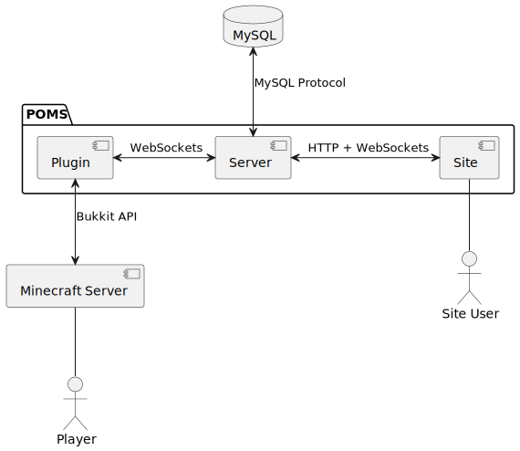

# POMS - Personal Offline-mode Minecraft Server administration system

## Table of Contents

- [About](#about);
- [Features](#features);
- [How to Use](#how-to-use);
- [Documentation](#documentation);
- [Roadmap](#roadmap);
- [Architecture](#architecture);
- [Project Structure](#project-structure);
- [Gallery](#gallery).

## About

**POMS** (**P**ersonal **O**ffline-**Mo**de Minecraft **S**erver administration system) was
initially created to provide easy-to-use way to add authentication and authorization mechanisms to
any Minecraft server with `online-mode` set to `false` in its configuration file (whitelist and
custom port number didn't save my server from being griefed). Beyond that POMS adds many more
quality-of-life [features](#features) about which you can read further. One of these features is
**Site** which allows for players and servers management without launching Minecraft and learning
all the **Plugin**'s commands.

## Features

***WIP***

## How to Use

***WIP***

## Documentation

***WIP***

## Roadmap

***WIP***

## Architecture

The architecture is pretty simple. **Server** communicates with user's browser using **HTTP** and
**WebSockets** protocols. With **Plugin** it communicates using **WebSockets** protocol solely.
It also uses **Elastic Search** as search engine.

Details on the communication protocols used can be found in the
[Documentation section](#documentation).

## Project Structure

The project consists of the several directories which names are mostly self-explanatory:

- [server](./server);
- [plugin](./plugin);
- [site](./site);
- [libs](./libs):
  - [commons](./libs/commons);
  - [mc](./libs/mc):
    - [commands](./libs/mc/commands);
    - [commons](./libs/mc/commons);
    - [nbt](./libs/mc/nbt);
    - [protocol](./libs/mc/protocol);
    - [status](./libs/mc/status).

Other directories not mentioned above contain either documentation and images, either some
build-related data.

## Gallery

***WIP***
