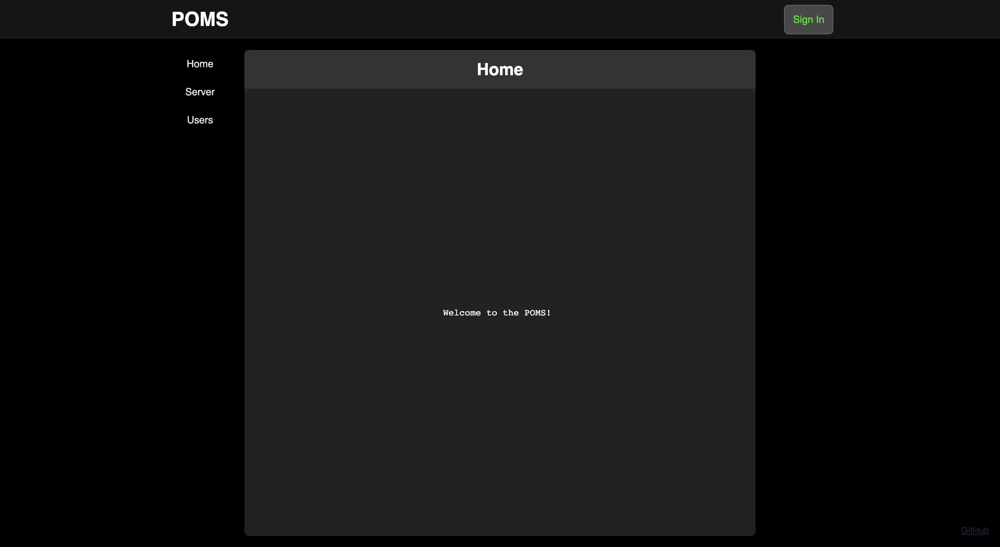
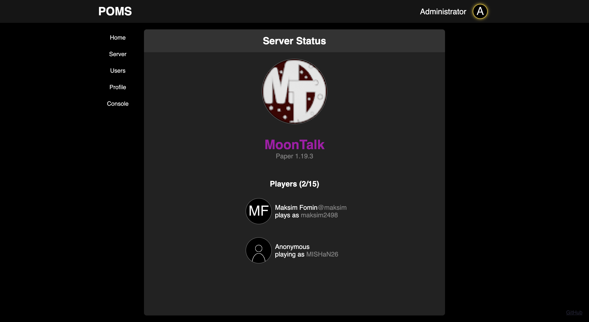
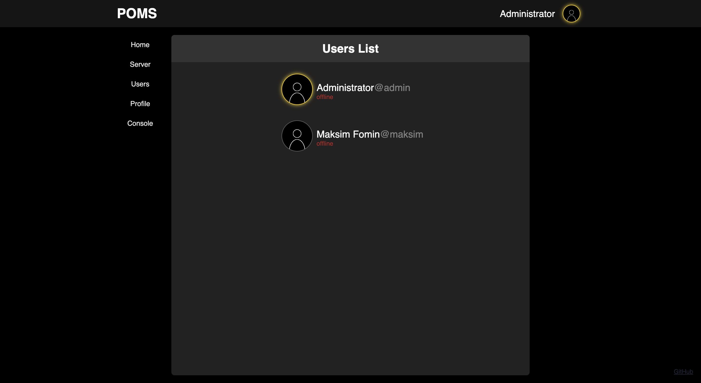
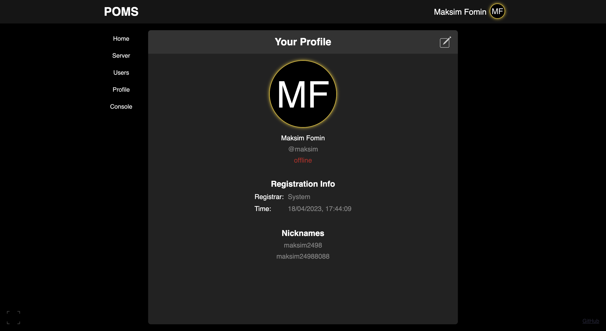
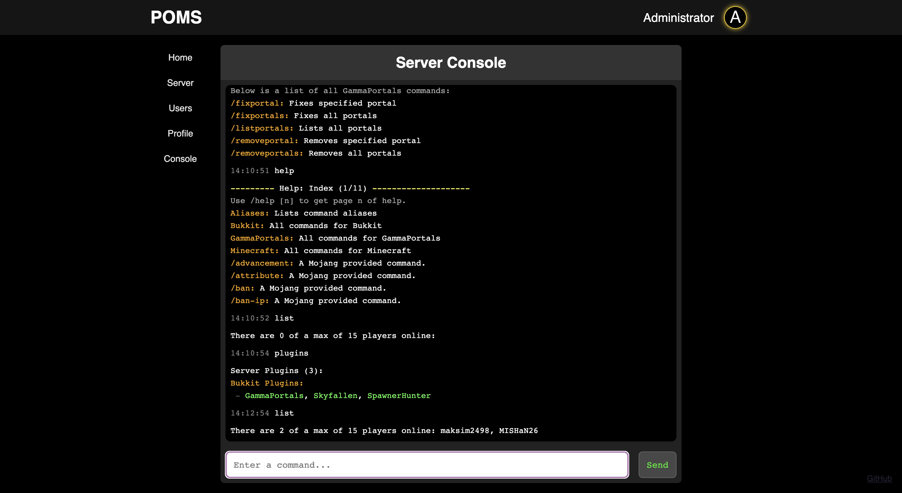

# POMS - Personal Offline-mode Minecraft Server administration system (__WIP__)


[](https://opensource.org/license/mit/)


## Table of Contents

- [Table of Contents](#table-of-contents);
- [About](#about);
- [Prerequisites](#prerequisites);
- [Installation](#installation);
- [Running](#running);
- [Documentation](#documentation);
- [Screenshots](#screenshots).

## About

This is all-in-one solution for administration of private offline-mode Minecraft server.
It consists of Bukkit plugin for Minecraft server, back-end server with REST API and front-end Web-based interface.
It provides the means for authorization, user management, and remote console access from browser (for administrators only).

You can get detailed information on project components in the following files:

- [Server](/server/README.md);
- [Site](/site/README.md);
- [Bukkit Plugin](/plugin/README.md).

## Prerequisites

To run and install server and site you need the following software installed on your machine:

- [Node.js](https://nodejs.org/);
- [MySQL](https://www.mysql.com/).

Install all of them if you don't have them already installed.

For building Bukkit plugin you'll also need _JDK 17+_ and [Maven build system](https://maven.apache.org).
You can also just download prebuilt plugin from [releases](https://github.com/Maksim2498/poms/releases)
section on [project's home page](https://github.com/Maksim2498/poms).

___Warning___:

This document wouldn't guide you through Bukkit plugin building process. To get more inforamtion on this topic see [this](/plugin/README.md).

## Installation

To install everything needed for running follow the steps listed below depending on your operating system.
This will install all _npm_ packages and will guide you through minimal required configuration. For advanced
configuration see [this](/server/docs/config.md).

__Windows__:

Simply double click on `install.bat` batch file or execute the following command in your terminal:

```sh
install.bat
```

__Unix-Like__:

Execute the following command in your terminal:

```sh
./install.sh
```

__Other__:

This method is universal and isn't dependent on your operating system.

Execute the following command in your terminal:

```sh
node install.mjs
```

## Running

To run __POMS__ follow the steps listed below depending on your operating system.

__Windows__:

Simply double click on `run.bat` file or execute the following command in your terminal:

```sh
run.bat
```

__Unix-Like__:

Execute the following command in your terminal:

```sh
./run.sh
```

__Other__:

This method is universal and isn't dependent on your operating system.

Execute the following commands in your terminal:

```sh
cd server
node start
```

## Documentation

- [Code of Conduct](/docs/CODE_OF_CONDUCT.md);
- [Security](/docs/SECURITY.md).

__Server__:

- [Configuration](/server/docs/config.md);
- [Database Schema](/server/docs/db-schema.md);
- [API Schema](/server/docs/api-schema.md);
- [Nginx](/server/docs/nginx.md);
- [Console Proxy](/server/docs/ws-console-schema.md).

__Site__:

Comming soon...

__Bukkit Plugin__:

Comming soon...

## Screenshots

The following are some site screenshots.






