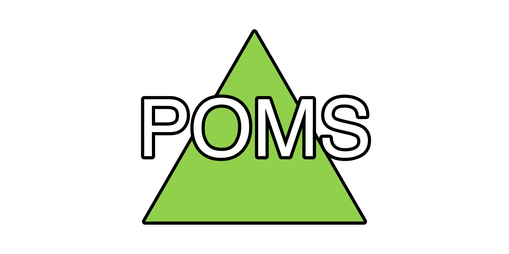

# POMS Server



## Table of Contents

- [Table of Contents](#table-of-contents);
- [About](#about);
- [Prerequisites](#prerequisites);
- [Setup](#setup);
- [Running](#running);
- [Documentation](#documentation).

## About

This is a server with REST API for [POMS](../README.md). It can work whether as stand-alone
application or as back-end behind some front-end Web-server like [nginx](https://nginx.org/).
This API is an essential part of POMS project, site and plugin are both completely built upon it.

## Prerequisites

To run this application you need the following software installed on your machine:

- [Node.js](https://nodejs.org/);
- [MySQL](https://www.mysql.com/).

Install all of them if you don't have them already installed.

## Setup

Firstly, simply install all required packages running the following command
in your terminal:

```sh
npm i
```

If nothing went wrong you now have all required packages installed and you can
proceed to the second setup step - configuration. All configuration is done
through `poms-config.json` file. This file can be created in any directory up
the filesystem tree relative to server launch directory. Create this file and
provide minumum set of options: MySQL user login and password.

Here is an example:

```json
{
    "mysql": {
        "login":    "your MySQL user login",
        "password": "your MySQL user password"
    }
}
```

After finishing all the steps described above you have application setup and ready for work.

## Running

After [setup](#setup) simply run the following command in your terminal:

```sh
npm start
```

Or the following to make Node.js working in the development environment for debug purposes:

```sh
npm run start:dev
```

## Documentation

All project documentation can be found in `/docs` folder. It contains documentation
on such topics as:

- [API Schema](./docs/api-schema.md);
- [Configuration](./docs/config.md);
- [Database Schema](./docs/db-schema.md).
